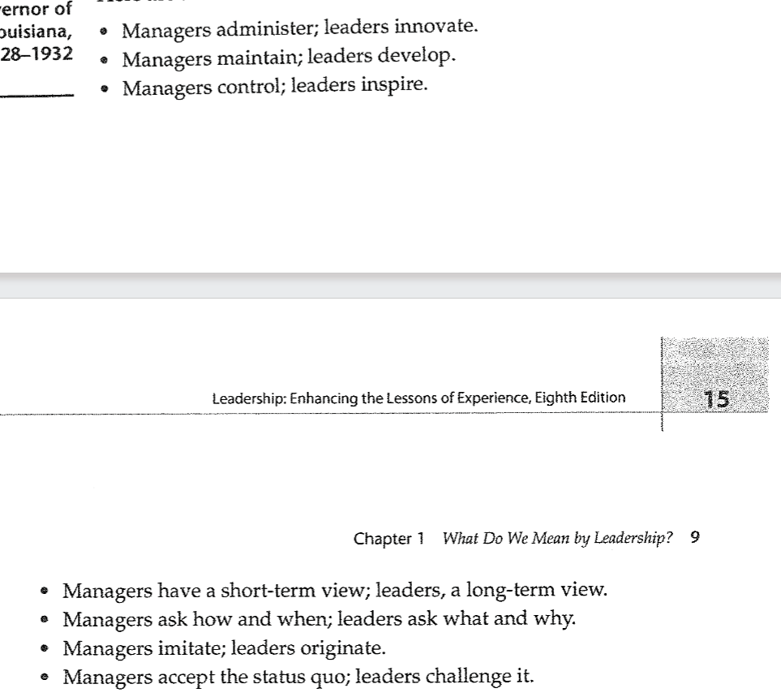

## Hughes, Ginnet, and Curphy; Leadership is a Process, not a Position pp. 7-15
---
> "Leadership involves something happening as a result of the _interaction between a leader and followers_"

To summarize leadership; leadership is basically an interaction between followers and leaders in the most **efficient way possible**.

> "Some have extended the latter viewpoint so far as to suggest there is no such thing as leadership; they argue that organizational successes and failures often get falsely attributed to the leader, but the situation may have a much greter impact on how the organization functions than does any individual, including the leader."

I mostly agree with this statement, sometimes leaders are not always leaders in the different situations they come across. For example one might require a more physically inclined leader that can actually assist. 

### Ways leadership is defined
* Directly controlling someone to behave a certain way
* Directing a group of peple
* Creating drive and motivation
* Influencing an organized group to accomplish a goal
* "Actions that focus resources to create desirable oppurtunities"
* Helping create a desirable condition for the team to efficiently work.
* Ability to get results and build teams properly.
* "Complex form of social problem solving"

What kind of leadership did Parrado use?
- He used a couple values to his advanatage. **Desperation, Convincing, and Infuence.**
- The book however says he just convinced them, but I personally blieve that the desperation of the moment led them to tat final solution.

**THERE IS NO SINGLE "CORRECT" DEFINITION OF LEADERSHIP**

> [!NOTE]
> Subordinate type leadership is essentially a type of leadership that expands downward into a hierarchical tree of relationships.

Cool question alert:
> Why do we not want to cultivate leaders who make decisions off of "logical predictability"?

Basically the book was saying that having emotion involved in leadership is very important because emotionally and rationally appealing to your followers will influence them much more to continue towards whatever goal is present.

> When someone is in a group, their actions may differ from when they are alone.

Difference between managment and leadership

## [Message from Howard Schultz...](https://stories.starbucks.com/press/2018/message-from-howard-schultz-to-partners-onward-with-love/)
Howard really just says that being your best will bring the best out of others.

## [7 Leadership Insight](https://northwest.education/insights/career-growth/7-leadership-definitions-insights-impact-2023/)
> "leadership is the ability to influence and guide others towards a common goal or vision"

I've noticed that a lot of articles really push "leadership" as a group effort sort of thing. I really don't believe it has anything to do with a group, but the people individually. Sure someone can be a great leader, but if the others aren't too a leader in their own lives, they will never support the main leader.

I also noticed they said **Leadership is the "ability" to influence others**. I actually believe this is a good way to show leadership as something that is deeply within everyone, but just needs to be refined.

> "A leader is defined as setting a direction"

This is a really nice quote. While the entire team may have the same goals, they may have different directions. Setting an ultimate direction to the goal is extremely important.

**Thinking outside the box** is another great attribute of a leader. Being able to think abstractly.

## NOTES
> [!WARNING]
> Leadership Triangle of death :(
> 

- Leadership involves soemthing happening as a result of the interation between leaders/followers.

In

